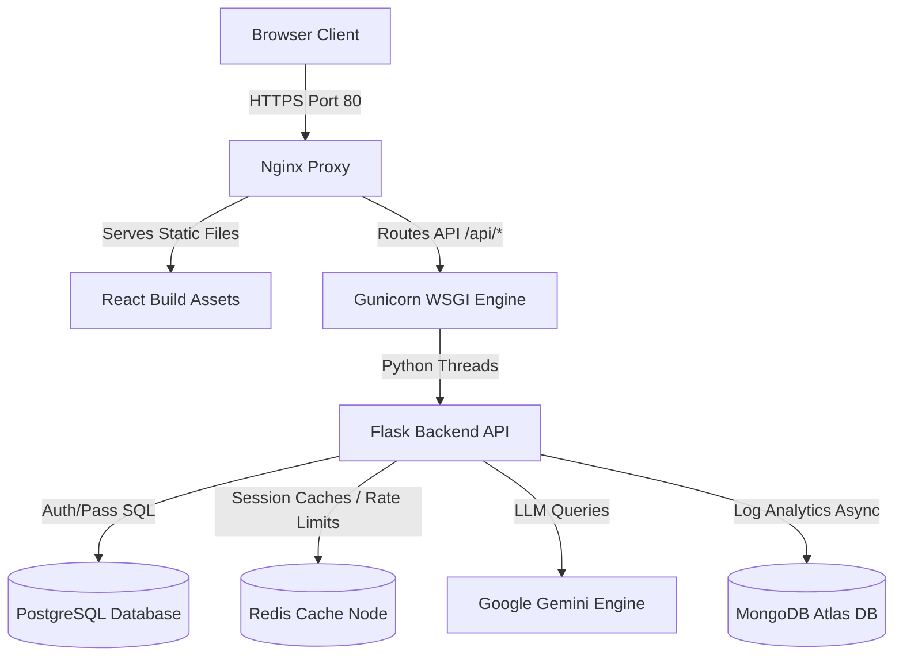
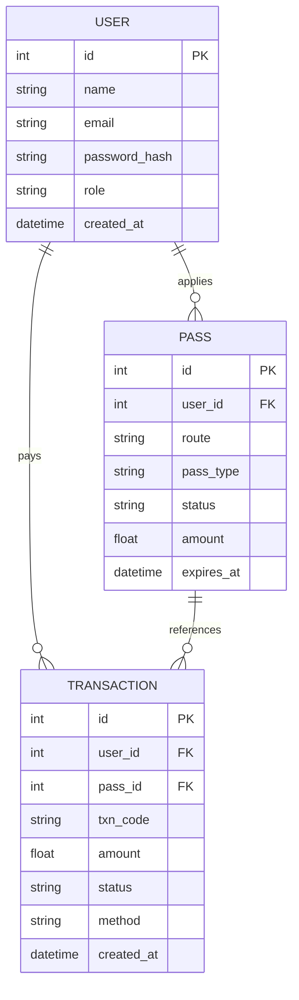
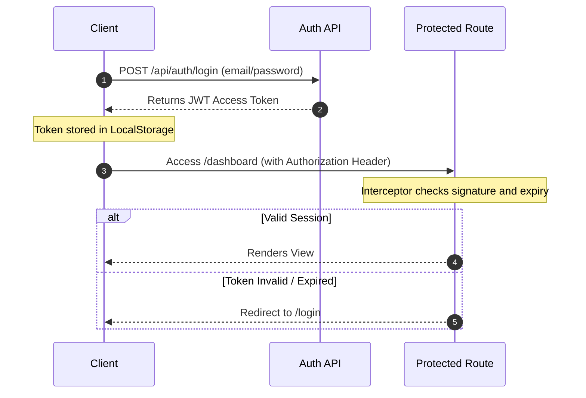
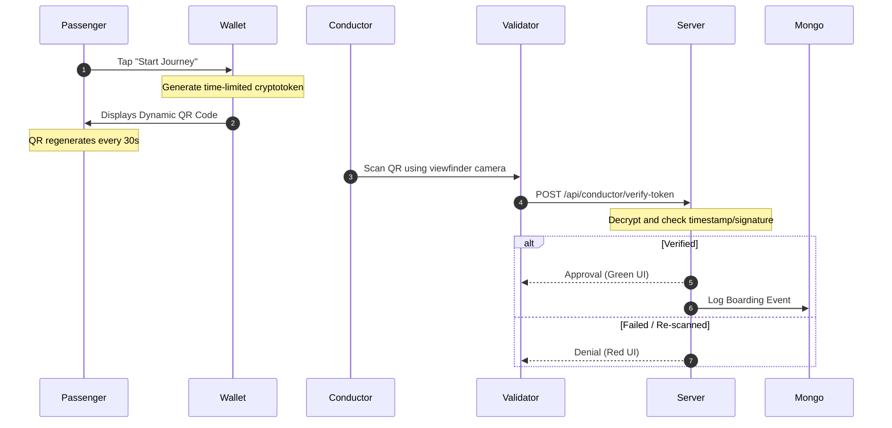
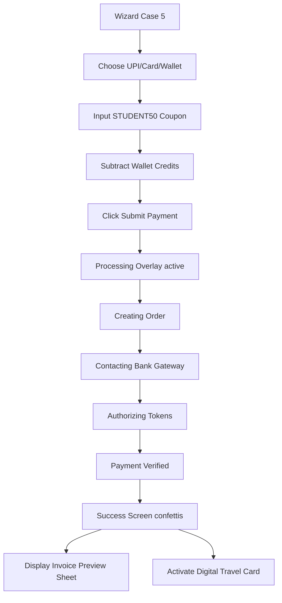
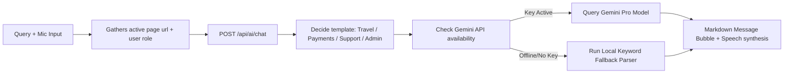
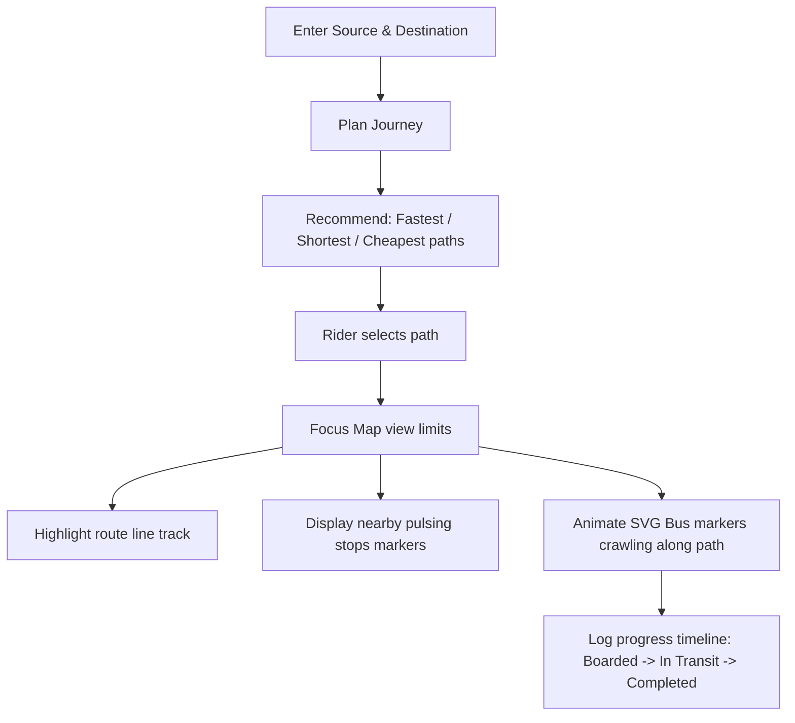
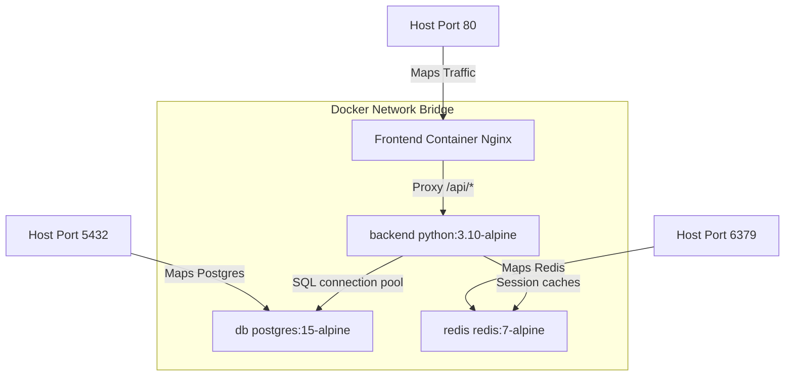
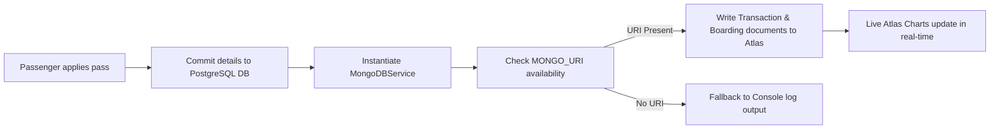

# SmartTransit Master Implementation Plan & System Diagrams

This document houses the complete system architecture, data models, and workflow diagrams for all features implemented inside the SmartTransit Cloud SaaS platform.

---

## 1. System Architecture Diagram

This maps the network requests boundary, caching nodes, and database isolation constraints.

---

## 2. Relational Database ER Diagram

The database structure handles referential constraints and cascading archives on deletions.

---

## 3. JWT Authentication Flow

Controls page redirections based on token verification.

---

## 4. Secure QR Boarding Verification Flow

The conductor validation camera viewfinder flow operates as follows:

---

## 5. Payments Checkout Processing Flow

Handles transaction stages and discount coupons (`STUDENT50`).

---

## 6. AI assistant Query Routing Flow

Attaches page URL and role parameters to helpdesk answers.

---

## 7. Smart Journey GIS tracking Flow

Compiles route Suggestions and coordinates updates.

---

## 8. Docker Compose Network Topography

Isolates containers inside a shared virtual bridge net.

---

## 9. MongoDB Atlas Analytics Logging Flow

Drives live charts from pass creations.

