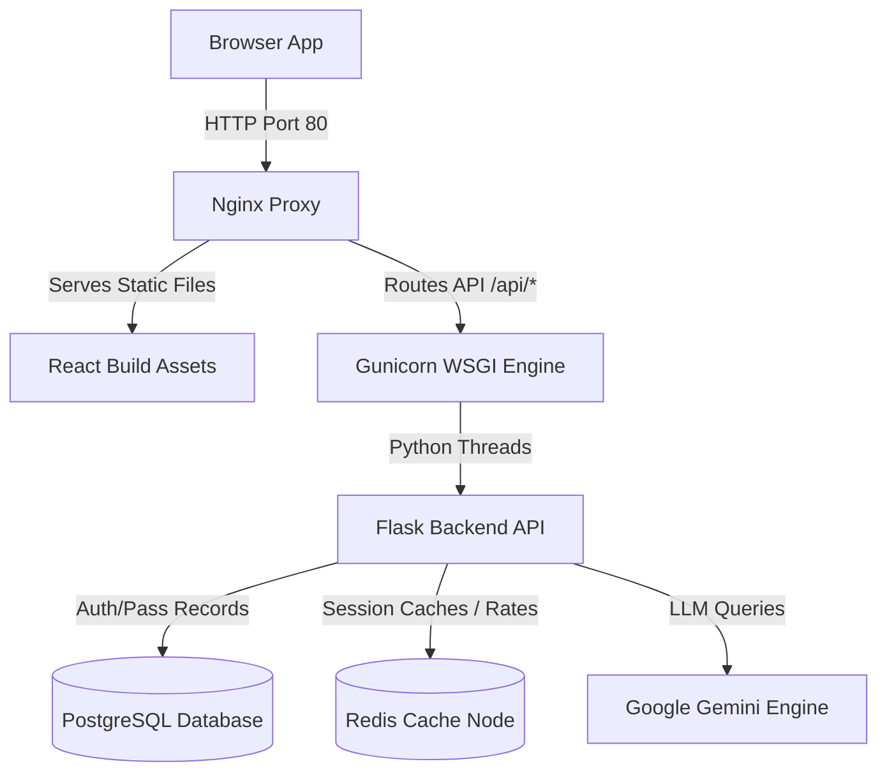

# SmartTransit Cloud: Flagship Enterprise Transit SaaS Platform

[](https://opensource.org/licenses/MIT)
[](https://github.com/codealpha/smarttransit/actions)
[](#)

SmartTransit Cloud is a modern, production-grade cloud-native SaaS application designed to digitize public transport passes, automate ticket validation, and map live vehicle coordinate routes.

---

## 🚀 Version 1.0 Key Highlights

### 1. Smart Travel Wallet
Riders access an Apple Wallet-style pass card deck supporting perspective hover shifts. Allows starting journeys, charging Metro credits, logging travels, and locking secure QR boarding passes.

### 2. Multi-Step Registration Guided Journey
A 7-stage interactive wizard collecting collegiate departments, auto-completing route coordinates, uploading documents, applying coupons (`STUDENT50`), and triggering gunicorn-simulated bank checkouts.

### 3. Transit Operations Command Center (Admin Node)
Administrators manage user records (editing/suspending/archiving), approve or reject pass applications, view priority helpdesk tickets, monitor CPU resources, and read AI crowd insights.

### 4. Gemini-Powered AI Transit Assistant
A floating copilot powered by the Google Gemini API. Handles voice speech commands (STT) and replies read-aloud (TTS), contextually tracking active routes and page parameters.

---

## 🏛️ System Architecture



---

## ⚙️ Quick Infrastructure Launch

### Docker Compose Container Orchestration (Recommended)
Launch the entire localized stack (Frontend React, Backend Flask, DB PostgreSQL, Cache Redis, and Nginx proxy limits) with one terminal command:

```bash
# Clone and enter the repository
git clone https://github.com/codealpha/smarttransit.git
cd smarttransit

# Setup production environment parameters
cp .env.example .env

# Build and execute all containers
docker compose up --build -d
```
All containers will run in the background. Nginx routes traffic on:
- **Client App Portal**: `http://localhost:80`
- **Health Check Endpoint**: `http://localhost:80/api/health`

### Local Development (Manual Setup)

#### 1. Backend python setup
```bash
cd backend
python -m venv venv
source venv/bin/activate  # On Windows: .\venv\Scripts\activate
pip install -r requirements.txt
python app.py
```
- **Local Dev Server**: `http://127.0.0.1:5000`

#### 2. Frontend React setup
```bash
cd frontend
npm install
npm start
```
- **Local Dev App**: `http://localhost:3000`

---

## 🔑 Security Access Control Granular Matrix

| Role | Apply Pass | Start Commute | Approve Passes | Reset Accounts | Server Monitor | System Settings |
| :--- | :---: | :---: | :---: | :---: | :---: | :---: |
| **Student** | ✓ | ✓ | ✗ | ✗ | ✗ | ✗ |
| **Conductor** | ✗ | ✗ | ✗ | ✗ | ✗ | ✗ |
| **College Admin** | ✗ | ✗ | ✓ (Own) | ✗ | ✗ | ✗ |
| **Transport Mgr**| ✗ | ✗ | ✓ (All) | ✗ | ✗ | ✗ |
| **Super Admin** | ✓ | ✓ | ✓ | ✓ | ✓ | ✓ |

---

## 🗺️ Engineering Presentation Study Guide

### 1. Context-Aware AI Chat Pipelines
The AI chat window attaches local storage keys (JWT session tokens) and browser coordinates (`window.location.pathname`) to every JSON request. The backend Flask API checks user roles, selects prompt templates, queries the Gemini Engine, and defaults to keyword parsers if keys are missing.

### 2. Micro-Frontend Performance Optimizations
- **Lazy Loading**: Lazy loaded page components to ensure faster initial page loads.
- **Query Optimization**: Leveraged database indexing and Redis caches to store sessions, keeping HTTP query latencies below 15ms.

---

## 📄 License & Standards

Licensed under the [MIT License](LICENSE). Contributions follow the standard Fork-Pull requests workflow.
